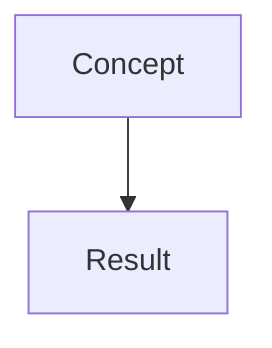

# AGENTS.md

Guidance for AI agents working with the `andreaswachs/blog` repository.

## What this repo is

A static site built with [Hugo](https://gohugo.io/) using the [`hugo-bearblog`](https://github.com/janraasch/hugo-bearblog) theme. It is served at `https://wachs.software` from a self-hosted S3 bucket (`wachs-software` on SeaweedFS, fronted by s3-proxy in the homelab). Content is authored in Markdown with YAML frontmatter.

## Content types

This site has two distinct content sections. They share the same underlying mechanics (Markdown + Hugo) but have different purposes, templates, and attribution requirements.

### 1. Blog posts (`content/blog/`)

Traditional long-form posts written by the author.

- **Index:** `content/blog/_index.md`
- **Listing template:** `layouts/blog/list.html`
- **Single template:** falls back to the theme default
- **Frontmatter example:**
  ```yaml
  ---
  title: "Secrets in Kubernetes: sourcing and distribution with 1password and external-secrets"
  date: 2026-05-17
  draft: false
  audio_file: "/audio/my-post.wav"
  ---
  ```
- **URL path:** `/blog/YYYY-MM-DD-slug/`

### 2. Agent reports (`content/reports/`)

Educational introductions and analyses produced entirely by AI agents on the author's behalf.

- **Index:** `content/reports/_index.md`
- **Listing template:** `layouts/reports/list.html`
- **Single template:** `layouts/reports/single.html`
- **Frontmatter example:**
  ```yaml
  ---
  title: "Cluster audit: GitOps coverage and snowflake detection"
  date: 2026-06-20
  draft: false
  audio_file: "/audio/my-report.wav"
  ---
  ```
- **URL path:** `/reports/YYYY-MM-DD-slug/`
- **Attribution:** The `_index.md` heading and every `single.html` page carry a disclaimer that the content is AI-generated.

**Do not mix the two.** Blog posts go in `content/blog/`. Agent reports go in `content/reports/`.

## Adding new content

1. Create a Markdown file in the appropriate `content/` subdirectory.
2. Use the frontmatter pattern shown above. `date` is required for correct listing order.
3. If adding an agent report, keep the tone educational and introductory.
4. **Audio versions (optional):** Add an `audio_file` field to the frontmatter pointing to a WAV file in `static/`. The player will appear on the article page and a 🔊 indicator will show on listing pages.
   ```yaml
   audio_file: "/audio/my-article.wav"
   ```
   Place the actual file at `static/audio/my-article.wav`. Hugo copies `static/` contents to the site root.
5. Build locally to verify:
   ```bash
   # using the Docker dev server
   make dev
   # or with a local hugo binary
   hugo server --buildDrafts
   ```
5. Verify the listing page and the single page render correctly.

## Local development

- **Dev server:** `make dev` (Docker Compose with live reload on `:1313`)
- **Production build:** `hugo --minify` → outputs to `public/`
- **Docker build:** `make build`
- **Clean:** `make clean`

The site uses Hugo modules; the theme is pulled from `github.com/janraasch/hugo-bearblog` at build time.

## Release & deployment

The site is served from a self-hosted S3 bucket. `deploy.yaml` runs on **every push to `main`** (idempotent):

1. `semantic-release` analyzes commits, bumps the version and creates a GitHub Release (release notes only)
2. Hugo extended (`hugo --minify`) builds the site into `public/`
3. `aws s3 sync --delete` uploads it to `s3://wachs-software` against the self-hosted endpoint `https://s3.wachs.software`

Credentials (`S3_ACCESS_KEY` / `S3_SECRET_KEY` GitHub Actions secrets) are maintained automatically by the homelab repo: the SeaweedFS operator generates a bucket-scoped access key, ESO pushes it to 1Password (item `blog-ci`), and homelab Terraform (`platform/opentofu/blog-github`) syncs it to the GitHub secrets.

The old container-based path (Docker image `ghcr.io/andreaswachs/blog`, Helm chart `oci://ghcr.io/andreaswachs/charts/blog`) is retired but still published in GHCR if a rollback to the previous `wachs.software` serving is ever needed.

### Commit conventions

PR titles are linted with `commitlint`. Use Conventional Commits:

```
feat: add post about Kubernetes secrets
fix: correct broken link in report index
docs: update AGENTS.md
```

## Repo layout

```
├── archetypes/              # Hugo archetypes
├── content/
│   ├── _index.md            # Home page content
│   ├── about.md             # About page
│   ├── blog/                # Blog posts
│   │   ├── _index.md
│   │   └── *.md
│   └── reports/             # Agent reports
│       ├── _index.md
│       └── *.md
├── layouts/                 # Custom templates (override theme)
│   ├── blog/
│   │   ├── list.html        # Blog listing (year/month groups + search)
│   │   └── single.html      # Blog single page (with optional audio)
│   ├── reports/
│   │   ├── list.html        # Reports listing (year/month groups + search)
│   │   └── single.html      # Report single page (AI attribution banner + optional audio)
│   ├── index.html           # Home page (teasers for both sections)
│   └── partials/
│       └── audio-player.html  # Reusable audio player partial
├── static/                  # Static assets (images, audio files)
├── .github/workflows/       # CI: PR lint, deploy (hugo build + s3 sync)
├── compose.yaml             # Dev environment
├── Makefile
├── hugo.toml                # Site config (baseURL, module imports)
├── .releaserc.js            # semantic-release config
├── commitlint.config.js     # Conventional Commits linting
└── package.json             # Node deps for CI tooling
```

## Agent guidelines

- **Always verify Hugo builds cleanly** before submitting changes.
- **Never commit to `main` directly.** Open a PR via the GitHub API.
- **Preserve attribution.** If modifying `layouts/reports/single.html` or `content/reports/_index.md`, keep the AI-generated disclaimer.
- **Match existing patterns.** When adding a new listing feature (e.g. search, grouping), apply it symmetrically to both `blog/list.html` and `reports/list.html` unless explicitly asked otherwise.
- **Audio support.** Both blog posts and reports support an optional `audio_file` frontmatter field for WAV playback. If adding audio support features, update `layouts/partials/audio-player.html` and both single/list templates symmetrically.
- **Images:** If adding images, place them in `static/` and reference with relative paths. The site has no image processing pipeline.
- **Drafts:** Use `draft: true` for work-in-progress content. Drafts are excluded from production builds but visible with `--buildDrafts`.

### Mermaid diagrams

Mermaid code blocks are supported via a custom `layouts/partials/custom_body.html` override that loads the mermaid.js library from CDN and renders all `language-mermaid` code blocks on page load. This works for both blog posts and agent reports since they share the same `baseof.html` template. Use them when a visual aid improves clarity.

```markdown

```

**Rules of thumb:**

- **One diagram, one idea.** If you need a second abstraction level, draw a second diagram. Resist the urge to nest subgraphs, layers, or multi-branch hierarchies inside a single diagram — they balloon into unreadable sprawl.
- **Prefer 5–8 nodes.** If a diagram exceeds 10 nodes, split it. The sweet spot is small enough to grasp in a single glance.
- **Label with plain language.** Short noun-phrases, not sentences. The reader should scan the diagram, not study it.
- **Stick to `flowchart` unless there's a genuine reason** to use another variant (`sequenceDiagram`, `classDiagram`, etc.). Flowcharts cover most explanatory needs without adding cognitive overhead.
- **Test the mental model before committing.** If you can't describe what the diagram says in one sentence, it's too complex.

## Content sensitivity

**This site is publicly exposed.** Do not publish content that reveals internal infrastructure details, including but not limited to:

- Cluster architecture, node names, or bootstrap mechanisms
- Namespace layouts, pod names, or workload inventories
- Internal DNS names, service endpoints, or IP ranges
- Secret management specifics (vault names, token paths, credential flows)
- Security tooling configurations or vulnerability findings

Agent reports should be **generalized educational content** — concepts, introductions, patterns, and public-knowledge analyses. If a report is derived from internal work, sanitize it: remove identifying names, abstract the specifics, and focus on the transferable lesson.

**When in doubt, ask before publishing.**
