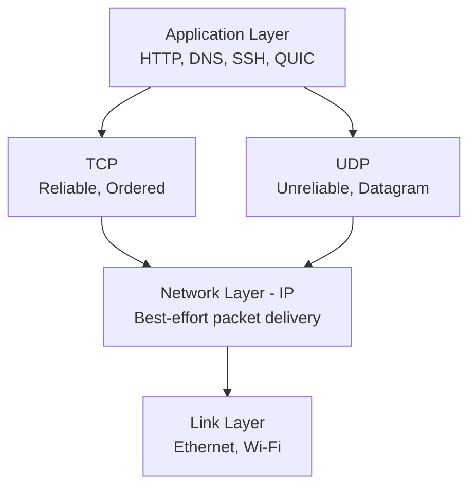
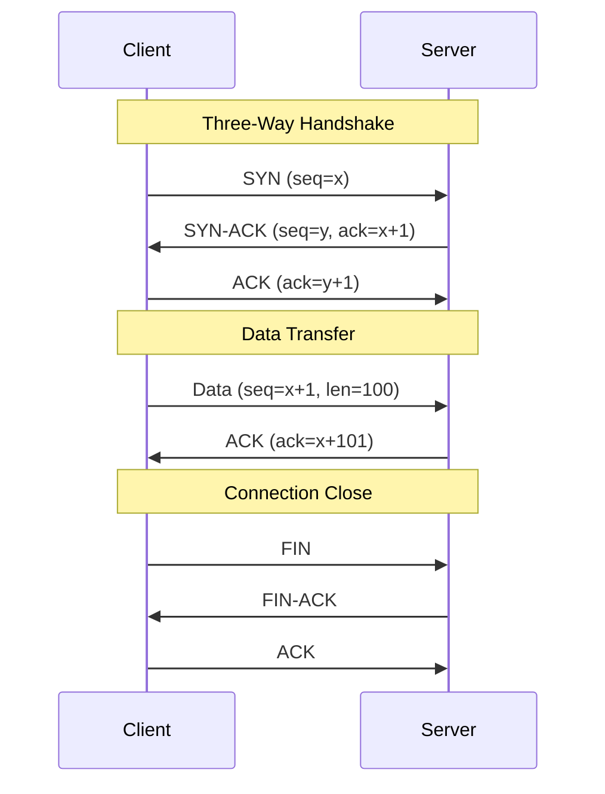
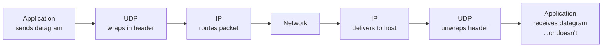
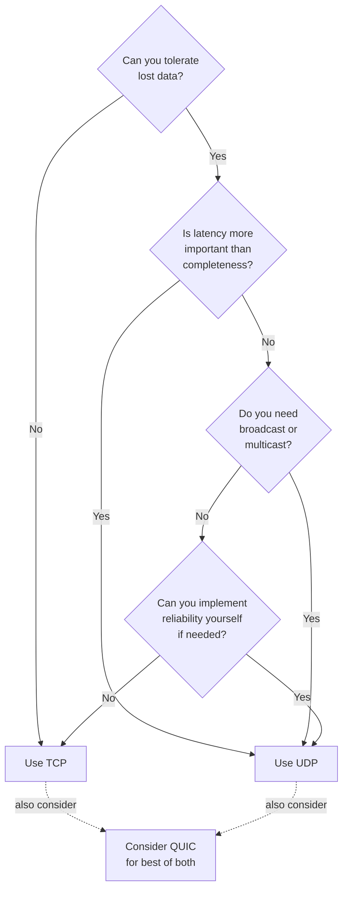

Every networked application you build sits on top of one of two transport protocols: **TCP** or **UDP**. They've been with us since the early 1980s, they power everything from web browsing to video calls, and yet their trade-offs are often reduced to a single misleading shorthand — "TCP is reliable, UDP is fast." That's directionally correct but misses the nuance that determines whether your application works well or falls apart under real network conditions.

This refresher covers what each protocol actually does, how they differ at the packet level, and — most importantly — when to reach for which one.

## Where TCP and UDP live

Both protocols sit at **Layer 4** (the transport layer) of the Internet protocol suite, sandwiched between the network layer (IP) and the application layer (HTTP, DNS, SSH, and everything you actually write).

IP's job is getting a packet from one machine to another — but that's *all* it does. It doesn't guarantee delivery, ordering, or even that packets won't be silently corrupted in transit. That's where TCP and UDP come in: they're the two different answers to "what should we do about IP's limitations?"

## TCP: reliable, ordered, and connection-oriented

TCP (**Transmission Control Protocol**) takes IP's best-effort packet delivery and builds a reliable byte stream on top of it. It guarantees that every byte you send arrives intact, in order, exactly once — or you get an error.

### The connection lifecycle

Before any data flows, TCP establishes a connection with a **three-way handshake**:

This handshake isn't just ceremony — it synchronises **sequence numbers** so both sides agree on where the byte stream starts. Every byte after that carries a sequence number; every received segment is acknowledged. If an acknowledgement doesn't arrive in time, TCP retransmits.

### How TCP delivers reliability

TCP's guarantees come from four core mechanisms working together:

1. **Acknowledgements (ACKs).** Every segment the receiver gets is acknowledged. If the sender doesn't see an ACK within a dynamically computed timeout (the **RTO**, or retransmission timeout), it sends the segment again.

2. **Sequence numbers.** Every byte is numbered. The receiver can detect missing segments — if bytes 1–100 and 201–300 arrive but 101–200 don't, it knows exactly what to ask for. This also lets TCP reassemble out-of-order packets correctly.

3. **Flow control.** The receiver advertises a **window size** — how many bytes it's prepared to buffer. The sender never sends more than the window allows, preventing a fast sender from overwhelming a slow receiver.

4. **Congestion control.** TCP probes the network to find the maximum safe sending rate, backing off when packet loss signals congestion. Algorithms like **Reno**, **CUBIC**, and **BBR** handle this differently, but they all follow the same principle: start slow, ramp up, and pull back at the first sign of trouble.

These mechanisms make TCP the backbone of the web. HTTP/1.1, HTTP/2, SSH, SMTP, and virtually every database protocol run over TCP because they *need* those guarantees.

### The cost of reliability

Everything TCP provides has a price:

- **Latency.** The three-way handshake adds one round-trip before the first byte of data. TLS on top adds at least one more.
- **Head-of-line blocking.** If segment #3 is lost, segments #4 through #100 sit in a buffer until #3 is retransmitted. The entire stream stalls behind one missing packet.
- **Overhead.** Every segment carries a 20-byte TCP header (minimum). ACK packets flow in both directions even when no application data is moving.

## UDP: minimal, stateless, and fast

**UDP** (User Datagram Protocol) is TCP's opposite: it takes IP's best-effort delivery and adds almost nothing. An 8-byte header containing source port, destination port, length, and a checksum — and that's it.

No handshake. No acknowledgements. No retransmission. No ordering. No flow control. No congestion control. UDP is a **datagram** protocol — each message is an independent unit that may arrive, may not, and may arrive in any order.

### What UDP doesn't do

This is the list that surprises people coming from TCP:

| UDP does NOT provide | What that means in practice |
|---|---|
| Connection establishment | You start sending immediately — no setup round-trip |
| Delivery guarantees | Packets can be silently dropped anywhere along the path |
| Ordering | Packets can arrive out of sequence |
| Duplicate protection | The same packet can arrive twice |
| Flow control | A fast sender can overwhelm a slow receiver |
| Congestion control | UDP will happily keep sending into a congested network |

### Why you'd want none of that

It sounds like a bad deal until you consider the use cases:

**Real-time media.** A VoIP call or video stream can't afford to wait for retransmission. If a 20ms audio frame is lost, playing silence is better than pausing for 200ms while TCP retransmits. The human ear and eye tolerate occasional gaps; they don't tolerate stutter.

**DNS.** Most DNS queries fit in a single packet. A three-way handshake to send 512 bytes would triple the latency for no benefit. If a query times out, the resolver retries at the application level.

**Gaming.** In a fast-paced multiplayer game, the server needs your position *now*, not your position from three retransmissions ago. Stale data is worse than missing data.

**Service discovery and multicast.** Protocols like mDNS and SSDP need to broadcast to all hosts on a network — something TCP can't do because it requires a dedicated connection.

## Head-to-head comparison

| Property | TCP | UDP |
|---|---|---|
| **Connection model** | Connection-oriented (state on both ends) | Connectionless (stateless) |
| **Reliability** | Guaranteed delivery via ACKs and retransmission | Best-effort; no delivery guarantee |
| **Ordering** | Strict byte-stream ordering | No ordering guarantees |
| **Header size** | 20–60 bytes | 8 bytes |
| **Setup latency** | 1 RTT (three-way handshake) | Zero |
| **Flow control** | Receiver-advertised window | None |
| **Congestion control** | Built into the protocol | None (left to the application) |
| **Broadcast/multicast** | Not supported | Supported |
| **Typical use** | Web, email, file transfer, databases | DNS, VoIP, streaming, gaming, IoT |

## Choosing between them

The fundamental question is: **can your application tolerate data loss, or is correctness non-negotiable?**

A few concrete heuristics:

- **Use TCP** when correctness trumps speed: file transfers, database queries, API calls, email delivery, any request/response pattern where missing data is unacceptable.
- **Use UDP** when timeliness trumps completeness: live audio/video, real-time game state, sensor telemetry at high frequency, DNS, service discovery.
- **Consider QUIC** when you want reliability *and* low latency on a modern stack. QUIC runs over UDP but provides TCP-like reliability with multiplexed streams (no head-of-line blocking), 0-RTT connection setup, and built-in TLS 1.3 encryption.

## QUIC: the elephant in the room

It's worth addressing **QUIC** (Quick UDP Internet Connections) because it's increasingly the real answer to "TCP or UDP?" in modern systems.

QUIC runs *on top* of UDP but provides what looks like TCP reliability: guaranteed delivery, ordering, and congestion control. The difference is that QUIC fixes TCP's architectural problems:

- **No head-of-line blocking.** QUIC multiplexes independent streams within a single connection. A lost packet on stream A doesn't block stream B.
- **0-RTT connection setup.** If you've connected to a server before, QUIC can send application data with the very first packet — no handshake wait.
- **Connection migration.** QUIC identifies connections by a connection ID, not by IP:port. You can switch from Wi-Fi to cellular without dropping the connection.

HTTP/3 is built on QUIC. If you're using a modern CDN or browser, a significant fraction of your web traffic already flows over QUIC-under-UDP rather than TCP. The protocol landscape is shifting.

## Why these distinctions still matter

With QUIC blurring the line, you might wonder why the TCP/UDP dichotomy is still worth understanding. Three reasons:

1. **Most of the internet still runs on TCP.** Understanding its behavior — especially head-of-line blocking and congestion control dynamics — explains a huge class of performance problems in distributed systems.

2. **UDP is the foundation for innovation.** QUIC exists precisely because UDP hands control back to the application. If you're building a custom protocol for a specialised domain (IoT mesh networks, satellite links, real-time multiplayer), UDP is your building block.

3. **Debugging.** When `connect()` hangs, when throughput drops mysteriously, when retransmission storms cascade — knowing what's happening at the transport layer is the difference between guessing and diagnosing.

## Sources

- [RFC 793 — Transmission Control Protocol](https://datatracker.ietf.org/doc/html/rfc793) (original TCP specification)
- [RFC 768 — User Datagram Protocol](https://datatracker.ietf.org/doc/html/rfc768)
- [RFC 9000 — QUIC: A UDP-Based Multiplexed and Secure Transport](https://datatracker.ietf.org/doc/html/rfc9000)
- [High Performance Browser Networking — Ilya Grigorik](https://hpbn.co/) (O'Reilly, also available free online)
- [The Cloudflare Blog — QUIC and HTTP/3](https://blog.cloudflare.com/http3-the-past-present-and-future/)
- [Kurose & Ross, *Computer Networking: A Top-Down Approach*](https://gaia.cs.umass.edu/kurose_ross/index.php) (standard networking textbook)
