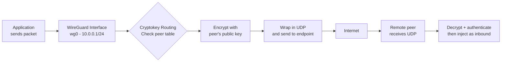
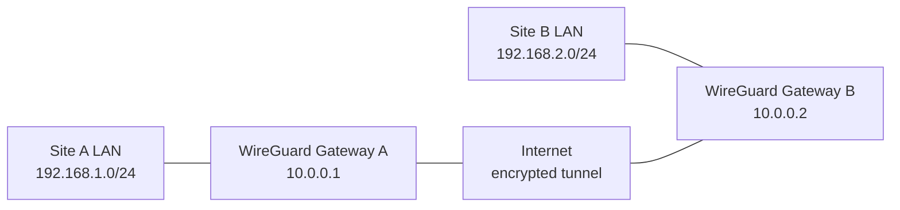
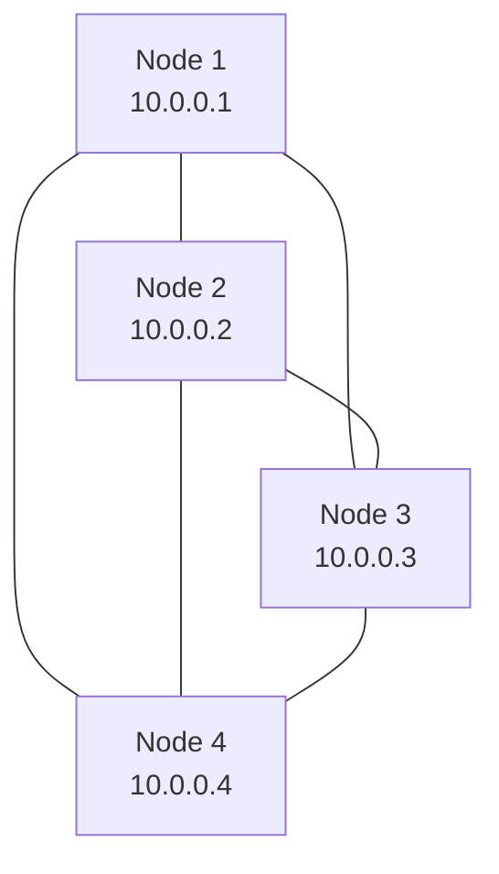

WireGuard is the VPN protocol that Linux kernel developers, cloud providers, and homelab operators have been flocking to since its mainline inclusion in 2020. It's fast, it's simple, and its codebase is roughly **4,000 lines** — compared to the hundreds of thousands of lines in OpenVPN or IPsec. This article explains what makes WireGuard different, walks through real-world use cases with example configurations, and gives you enough understanding to decide where it fits in your stack.

## What makes WireGuard different

WireGuard is the work of **Jason A. Donenfeld**, who designed it around three principles that set it apart from every VPN that came before:

**Small codebase, auditable surface.** At ~4,000 lines, the entire implementation can be read and reviewed in an afternoon. Compare that to OpenVPN's ~100,000 lines or IPsec's sprawling kernel subsystem. A smaller attack surface means fewer bugs and faster security audits.

**Cryptographic opinionation.** WireGuard doesn't offer cipher negotiation or algorithm agility. It uses exactly one set of modern primitives: **Curve25519** for key exchange, **ChaCha20** for symmetric encryption, **Poly1305** for authentication, **BLAKE2s** for hashing, and **SipHash24** for hash tables. There's no downgrade attack surface because there's nothing to downgrade.

**Kernel-native performance.** WireGuard runs inside the Linux kernel, avoiding the context-switch overhead that plagues userspace VPNs. It can saturate a 10 Gbps link on modest hardware while using a fraction of the CPU that OpenVPN requires.

## How WireGuard works

At its core, WireGuard is a **layer 3 tunnel** — it carries IP packets inside encrypted UDP datagrams. The mental model is simpler than most VPNs:



Every WireGuard interface has a **private key** (never shared) and a **public key** (shared with peers). The magic is in how these keys interact with the routing table — a concept Donenfeld calls **cryptokey routing**.

### Cryptokey routing

Traditional VPNs separate routing from authentication: you configure IP routes in one place, certificates in another, and firewall rules in a third. WireGuard merges all of this into a single peer table. Each peer entry declares:

- The peer's **public key** (identity + encryption key)
- An **AllowedIPs** list (which IP ranges this peer is authorised to send/receive)
- An optional **Endpoint** (the peer's public IP:port)

When the kernel needs to send a packet, it looks up the destination IP in the peer table. If there's a match, it encrypts the packet with that peer's session key and sends it to their endpoint. When a packet arrives, WireGuard decrypts it and checks: does the source IP fall within the sender's AllowedIPs? If not, the packet is silently dropped.

This means **routing is authentication.** You can't spoof an IP address from inside the tunnel, because each peer is cryptographically bound to the addresses it's allowed to use.

### The handshake

WireGuard uses the **Noise Protocol Framework** (specifically Noise_IK) for its 1-RTT handshake. Unlike TLS, which can take multiple round trips, WireGuard establishes a session in a single exchange:

1. Initiator sends a handshake initiation message containing its ephemeral public key, encrypted with the responder's static public key
2. Responder replies with its own ephemeral key, also encrypted
3. Both sides derive a pair of symmetric session keys from the exchange

If no data is exchanged for a few minutes, the session goes silent. When new data needs to flow, a fresh handshake happens transparently. This is called **silence is a feature** — an idle WireGuard tunnel sends zero packets and is indistinguishable from a closed port to anyone scanning.

The underlying protocol is detailed in the [WireGuard whitepaper](https://www.wireguard.com/papers/wireguard.pdf), which is remarkably readable for a cryptography paper.

## Use cases with example configurations

### Use case 1: Road warrior — laptop to home network

The classic: you're at a coffee shop and want to access your home server, NAS, or homelab services as if you were on the couch.

**Server** (at home, public IP `203.0.113.10`, internal network `192.168.1.0/24`):

```ini
[Interface]
PrivateKey = <server-private-key>
ListenPort = 51820
Address = 10.0.0.1/24

[Peer]
# Andreas's laptop
PublicKey = <laptop-public-key>
AllowedIPs = 10.0.0.2/32
```

**Client** (laptop, anywhere on the internet):

```ini
[Interface]
PrivateKey = <laptop-private-key>
Address = 10.0.0.2/24

[Peer]
# Home server
PublicKey = <server-public-key>
Endpoint = 203.0.113.10:51820
AllowedIPs = 10.0.0.0/24, 192.168.1.0/24
```

The client's `AllowedIPs` entry is doing double duty here: it tells WireGuard which traffic to send through the tunnel (the `10.0.0.0/24` WireGuard subnet and the `192.168.1.0/24` home LAN) *and* cryptographically binds the server to those addresses. The laptop's own `AllowedIPs = 10.0.0.2/32` ensures only that laptop can claim that tunnel address.

### Use case 2: Site-to-site — connecting two networks

Two offices, two homes, or a home and a VPS — WireGuard bridges their private subnets as if they shared a router.



**Gateway A:**

```ini
[Interface]
PrivateKey = <gw-a-private-key>
ListenPort = 51820
Address = 10.0.0.1/24

[Peer]
# Gateway B
PublicKey = <gw-b-public-key>
Endpoint = 198.51.100.20:51820
AllowedIPs = 10.0.0.2/32, 192.168.2.0/24
PersistentKeepalive = 25
```

**Gateway B:**

```ini
[Interface]
PrivateKey = <gw-b-private-key>
ListenPort = 51820
Address = 10.0.0.2/24

[Peer]
# Gateway A
PublicKey = <gw-a-public-key>
Endpoint = 203.0.113.10:51820
AllowedIPs = 10.0.0.1/32, 192.168.1.0/24
PersistentKeepalive = 25
```

The key detail here is `PersistentKeepalive = 25` — WireGuard is silent by default, but NAT gateways forget UDP mappings after a timeout (often 30–120 seconds). If one gateway is behind NAT and the other has a static IP, the NAT-side gateway needs to send a keepalive every 25 seconds so the static-side gateway can always reach it. Without this, the tunnel works fine when the NAT-side initiates, but inbound connections time out.

Each gateway also needs IP forwarding enabled and an iptables masquerade rule if you want LAN clients to use the tunnel transparently:

```bash
# Enable forwarding
sysctl -w net.ipv4.ip_forward=1

# Masquerade WireGuard traffic onto the local LAN
iptables -t nat -A POSTROUTING -o eth0 -j MASQUERADE
```

### Use case 3: Mesh VPN — multiple nodes, any-to-any

When you have more than a handful of nodes, a star or full mesh beats point-to-point links. WireGuard supports this natively — just add each node as a peer on every other node.



A 4-node full mesh means each node has 3 peer entries. At 10–20 nodes this is manageable by hand. Beyond that, tools like **Netmaker**, **Tailscale** (which uses WireGuard under the hood), or **Headscale** automate the mesh generation and key distribution.

For a manual small mesh, here's the config pattern for one node (the others follow the same template):

```ini
[Interface]
PrivateKey = <node-1-private-key>
ListenPort = 51820
Address = 10.0.0.1/24

[Peer] # Node 2
PublicKey = <node-2-public-key>
Endpoint = node2.example.com:51820
AllowedIPs = 10.0.0.2/32

[Peer] # Node 3
PublicKey = <node-3-public-key>
Endpoint = node3.example.com:51820
AllowedIPs = 10.0.0.3/32

[Peer] # Node 4
PublicKey = <node-4-public-key>
Endpoint = node4.example.com:51820
AllowedIPs = 10.0.0.4/32
```

### Use case 4: Split tunneling — VPN only what you need

Routing all traffic through a VPN is overkill when you just need access to a few private services. With WireGuard, `AllowedIPs` gives you precise control:

```ini
[Interface]
PrivateKey = <client-private-key>
Address = 10.0.0.5/24

[Peer]
PublicKey = <server-public-key>
Endpoint = vpn.example.com:51820
# Only route private subnets through the tunnel — everything else goes direct
AllowedIPs = 10.0.0.0/24, 192.168.1.0/24
```

Traffic to `8.8.8.8`, `github.com`, or any other public address goes out your normal internet connection — only traffic destined for the listed subnets enters the tunnel. This is the default for site-to-site and road warrior configs, and it's one of the reasons WireGuard feels lightweight: it doesn't hijack your entire network stack unless you explicitly set `AllowedIPs = 0.0.0.0/0`.

### Use case 5: Container networking

WireGuard works beautifully in containers because it's just a network interface. In Docker, you can give a container its own WireGuard interface:

```bash
# On the host, create the WireGuard interface
ip link add dev wg0 type wireguard
wg setconf wg0 /etc/wireguard/wg0.conf
ip addr add 10.0.0.1/24 dev wg0
ip link set wg0 up
```

Then launch the container with `--network=host` or move the `wg0` interface into the container's network namespace. Kubernetes operators use the same pattern — WireGuard interfaces in pods — to build encrypted overlay networks between clusters without a service mesh.

## WireGuard vs the alternatives

| | WireGuard | OpenVPN | IPsec |
|---|---|---|---|
| **Code size** | ~4,000 lines | ~100,000 lines | ~400,000 lines (StrongSwan) |
| **Kernel integration** | Native (Linux 5.6+) | Userspace only | Native (complex) |
| **Cipher negotiation** | None (fixed set) | Extensive (dangerous combination surface) | Extensive |
| **Roaming** | Seamless (stateless) | Requires reconnect | Requires rekey + IKE renegotiation |
| **Idle behaviour** | Silent (zero packets) | Keepalive pings | Keepalive pings |
| **Configuration complexity** | Single INI-style file | Certificate + config + scripts | Certificate + complex policy |
| **Mobile-friendly** | Excellent (roaming, low power) | Moderate | Poor |

The biggest practical difference is **roaming**. WireGuard is connectionless at the transport layer — it's just encrypting and sending UDP packets. If your laptop switches from Wi-Fi to cellular, the tunnel keeps working because there's no connection state to re-establish. OpenVPN and IPsec both require a full reconnection when the source IP changes, which on a moving device means a constant cycle of drop-and-reconnect.

## Kernel vs userspace implementations

WireGuard's reference implementation lives in the Linux kernel, but there are portable userspace implementations for platforms that can't run kernel code:

| Implementation | Where it runs | Notes |
|---|---|---|
| **Linux kernel `wireguard`** | Linux 5.6+ | The reference; fastest, simplest deployment |
| **wireguard-go** | macOS, Windows, FreeBSD, any Go target | Official userspace port by Donenfeld |
| **boringtun** | Any Rust target | Cloudflare's userspace implementation, audited |
| **WireGuardNT** | Windows kernel | Native Windows kernel driver, ships with the official client |

For Docker, Kubernetes, and other container environments, **wireguard-go** is the usual choice — it runs in userspace inside the container without needing kernel modules. For bare-metal servers, the kernel module delivers the best throughput.

## When to use WireGuard, and when not to

**Use WireGuard when:**

- You need a VPN that's simple to configure and debug
- Your clients roam between networks (laptops, phones)
- You're building infrastructure (site-to-site, Kubernetes CNI)
- You want a codebase small enough to audit
- You need low overhead and high throughput

**Consider alternatives when:**

- You need legacy cipher support for regulatory compliance (WireGuard's fixed cipher suite won't satisfy FIPS requirements)
- You're integrating with an existing PKI that only speaks IPsec/IKEv2
- You need advanced traffic shaping, per-user policy, or deep packet inspection built into the VPN layer (WireGuard is intentionally minimal — you layer those on top)

## Getting started

On any modern Linux distribution:

```bash
# Install the tools
apt install wireguard-tools    # Debian/Ubuntu
dnf install wireguard-tools    # Fedora

# Generate keys
wg genkey | tee private.key | wg pubkey > public.key

# Create config (/etc/wireguard/wg0.conf)
# Bring up the interface
wg-quick up wg0

# Check status
wg show
```

That's it. No certificate authorities, no Diffie-Hellman parameter files, no TLS cipher strings. Two keys, a handful of IPs, and you're routing encrypted traffic.

## Sources

- [WireGuard: Next Generation Kernel Network Tunnel](https://www.wireguard.com/papers/wireguard.pdf) — Donenfeld's NDSS 2017 whitepaper
- [WireGuard official site](https://www.wireguard.com/) — quickstart guides and protocol documentation
- [Noise Protocol Framework](https://noiseprotocol.org/) — the handshake protocol WireGuard is built on
- [Cloudflare — boringtun](https://github.com/cloudflare/boringtun) — Rust userspace implementation
- [Tailscale — How Tailscale works](https://tailscale.com/blog/how-tailscale-works) — practical mesh networking built on WireGuard
- [wireguard-go](https://git.zx2c4.com/wireguard-go/) — official Go userspace implementation
- [Arch Wiki — WireGuard](https://wiki.archlinux.org/title/WireGuard) — comprehensive reference for configuration and troubleshooting
