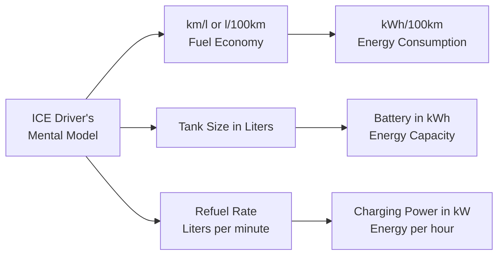
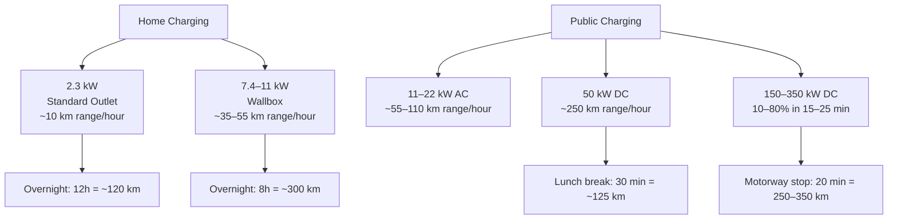
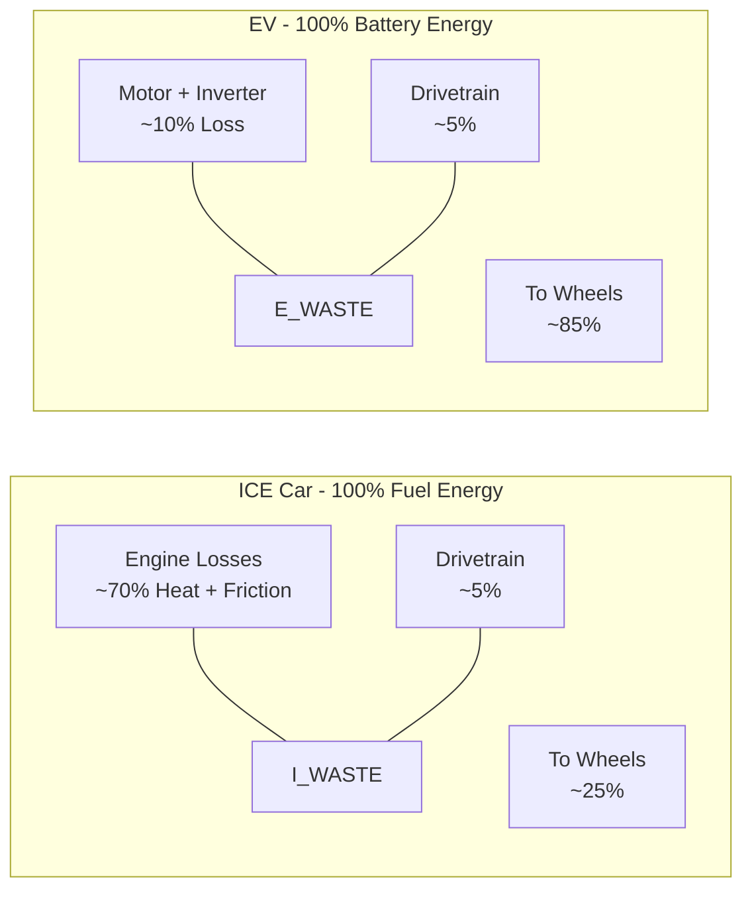

If you've spent years thinking about cars in terms of kilometers per liter and tank capacity in liters, the switch to electric vehicles throws an entirely new set of numbers at you. Kilowatt-hours, kilowatts, and "kWh per 100 kilometers" feel like a foreign language — but they map cleanly onto concepts you already understand. This article builds the bridge.

## The two numbers that matter

With an ICE car, you track two things:

- **Consumption** — how far a liter of fuel takes you (km/l), or how many liters you burn per 100 km (l/100km)
- **Tank size** — how many liters the tank holds, which determines how far you can go between fill-ups

The EV equivalents are:

- **Energy consumption** — measured in **kWh/100km** (lower is better, just like l/100km)
- **Battery capacity** — measured in **kWh** (the "tank size," in energy rather than volume)

If that already clicks, you have the mental model. The rest of this article is about refining it — understanding the charging side, the cost side, and how real-world conditions affect both types of car differently.

## The ICE-to-EV conversion table

Here's how the core numbers translate, with real-world reference values so the units mean something:

| ICE Metric | EV Equivalent | Typical values | What it tells you |
|---|---|---|---|
| **km/l** | **kWh/100km** | 14–22 kWh/100km | Higher km/l = lower kWh/100km = more efficient |
| **Tank (liters)** | **Battery (kWh)** | 40–100 kWh | How much energy you can store |
| **Range (km)** | **Range (km)** | 200–600 km | Tank × km/l = Battery ÷ kWh/100km × 100 |
| **l/100km** | **kWh/100km** | 15–20 typical | Same formula: litres per 100 vs kWh per 100 |
| **Fuel cost (€/l)** | **Electricity cost (€/kWh)** | €0.05–0.60/kWh | How much a "full tank" costs |

### Range: the same formula, different units

The math is identical in structure:

| | ICE | EV |
|---|---|---|
| **Formula** | Range = tank (L) × km/L | Range = battery (kWh) ÷ kWh/100km × 100 |
| **Example** | 50 L × 15 km/L = **750 km** | 60 kWh ÷ 18 kWh/100km × 100 = **333 km** |
| **Real car** | VW Golf diesel | VW ID.3 (58 kWh) |

Notice the EV number is lower. That's the trade-off: batteries store far less energy per kilogram than liquid fuel. A 50-liter diesel tank holds roughly **500 kWh** of chemical energy. A 60 kWh battery holds **60 kWh** of electrical energy. The EV makes up for it by being roughly **3–4× more efficient** at turning stored energy into motion — an ICE engine wastes ~65–75% of fuel energy as heat, while an electric motor wastes only ~10–15%.

## Consumption: what "kWh/100km" feels like

The difference between a thirstier and a thriftier EV is smaller than you might expect. Here's how consumption translates to real range for different battery sizes:

| Car type | Consumption (kWh/100km) | 40 kWh battery | 60 kWh battery | 80 kWh battery |
|---|---|---|---|---|
| **Efficient sedan** (Model 3, Ioniq 6) | 14 | 286 km | 429 km | 571 km |
| **Family crossover** (ID.4, EV6) | 18 | 222 km | 333 km | 444 km |
| **Large SUV** (EQE SUV, iX) | 22 | 182 km | 273 km | 364 km |
| **E-transit / pickup** | 28 | 143 km | 214 km | 286 km |

A useful benchmark: **15 kWh/100km** is roughly the EV equivalent of a car that does **20 km/l** in diesel terms — thrifty but not unusual for a modern sedan. At **20 kWh/100km** you're in crossover territory, comparable to a petrol car doing ~14 km/l.

## The charging side: kW is your refueling rate

In an ICE car, you think about fueling speed in terms of *minutes at the pump* — and it's always fast: 50 liters in 2–3 minutes. With an EV, charging speed varies hugely depending on where you plug in. The unit is **kilowatts (kW)** — a rate of energy transfer — and the mental math is "how many kWh do I add per hour at this charger?"

### Charging speed in familiar terms

A simple conversion: **1 kW of charging power adds roughly 5–7 km of range per hour**, depending on the car's efficiency. So:

| Charger | Power | Range added in 1 hour | Range added in 20 minutes |
|---|---|---|---|
| Household socket | 2.3 kW | ~12 km | ~4 km |
| Home wallbox | 7.4 kW | ~40 km | ~13 km |
| Public AC | 11 kW | ~60 km | ~20 km |
| DC fast (old) | 50 kW | ~280 km | ~90 km |
| DC fast (modern) | 150 kW | — | ~170 km (10–80%) |
| Ultra-fast | 250 kW | — | ~280 km (10–80%) |

The "10–80%" caveat matters: EV batteries charge fastest when they're nearly empty and slow down dramatically above 80%. The last 20% can take as long as the first 70%. For road trips, the efficient strategy is to charge from 10% to 80% and get back on the road — not to wait for 100%.

## Cost: translating €/l to €/kWh

This is where the EV advantage either shines or disappears, depending on where and when you charge:

| Charging scenario | Price per kWh | Cost per 100 km (at 18 kWh/100km) | Equivalent fuel price (at 15 km/l diesel) |
|---|---|---|---|
| **Home, night tariff** | €0.05 | **€0.90** | €0.14/l diesel |
| **Home, standard** | €0.25 | **€4.50** | €0.68/l diesel |
| **Public AC** | €0.40 | **€7.20** | €1.08/l diesel |
| **DC fast (highway)** | €0.60 | **€10.80** | €1.62/l diesel |

Charging at home on a night tariff is dramatically cheaper than any ICE — you're paying the equivalent of €0.14 per liter of diesel. But relying entirely on highway fast chargers at €0.60/kWh approaches — and sometimes exceeds — the cost of driving a diesel car. The economics of an EV depend almost entirely on *where you charge*.

## The energy flow: where the fuel goes

This is the single biggest difference between ICE and EV: where the energy actually ends up. In an ICE car, most of the fuel's energy leaves through the radiator and exhaust as waste heat. In an EV, almost all the energy from the battery reaches the wheels.

This efficiency gap has practical consequences:

- **EV range drops less in city traffic** than ICE range does. An EV uses almost no energy when stationary; an ICE engine keeps burning fuel while idling. Start-stop traffic favours EVs.
- **EV range drops more at highway speeds** than you might expect. Air resistance increases with the square of speed, and since the EV isn't wasting 70% of its energy to begin with, the aerodynamic penalty hits proportionally harder.
- **Cold weather affects both, but differently.** An EV uses battery energy to heat the cabin — there's no "free" waste heat from the engine. This can cut range by 15–30% in winter. An ICE car can use engine waste heat for the cabin, but cold starts increase fuel consumption until the engine warms up.

## A worked example: your next road trip

Let's take a concrete trip — Copenhagen to Hamburg, roughly 350 km — and compare a diesel Golf to an ID.3:

| | VW Golf 2.0 TDI | VW ID.3 (58 kWh) |
|---|---|---|
| **Consumption** | 5.0 l/100km | 18 kWh/100km |
| **Tank / Battery** | 50 liters | 58 kWh |
| **Theoretical range** | 1,000 km | 322 km |
| **Fuel needed for trip** | 17.5 liters | 63 kWh |
| **Stops needed** | 0 | 1 (20 min at 150 kW) |
| **Fuel cost** | €28 (at €1.60/l) | €11 (night tariff) to €38 (DC fast) |

The ID.3 needs a charging stop the Golf doesn't. On a home-charged battery at €0.05/kWh, the trip costs under €11 — less than half the diesel cost. Charged entirely at highway fast chargers at €0.60/kWh, the cost is about €38 — more than the diesel.

**The trade-off crystalises:** EVs shift your refueling from "5 minutes at a station, whenever" to "mostly at home while you sleep, with occasional 20-minute stops on long trips." If you can charge at home or work, the EV wins on both cost and convenience for daily driving. If you can't, the math gets tighter.

## The numbers to memorise

If you take nothing else from this article, remember these five benchmarks. They're enough to evaluate any EV you're considering:

1. **15 kWh/100km** — a thrifty modern EV (sedan, efficient hatchback)
2. **20 kWh/100km** — a typical electric crossover or SUV
3. **60 kWh battery** — the sweet spot for most people (280–400 km real range)
4. **7.4 kW home charging** — adds ~40 km of range per hour; a full charge overnight
5. **150 kW DC fast charging** — adds ~170 km in 20 minutes (10–80%)

With those five numbers and the formulas above, you can calculate range, charging time, and cost for any EV on the market — no need to learn a new way of thinking, just new units for the same old concepts.

## Sources

- [European Environment Agency — Electric vehicles: a smart choice for the environment](https://www.eea.europa.eu/en/topics/in-depth/electric-vehicles)
- [US Department of Energy — Fuel Economy of Electric Vehicles](https://www.fueleconomy.gov/feg/evtech.shtml)
- [EV Database — Real-world range and consumption data](https://ev-database.org/) (crowd-sourced EV specifications)
- [A Better Routeplanner](https://abetterrouteplanner.com/) — real-world trip planning with charging stops
- [Tesla — Charging calculator and Supercharger network data](https://www.tesla.com/support/charging)
- [ADAC — Elektroauto-Reichweite und Verbrauch](https://www.adac.de/rund-ums-fahrzeug/elektromobilitaet/) (German automobile club EV testing)
