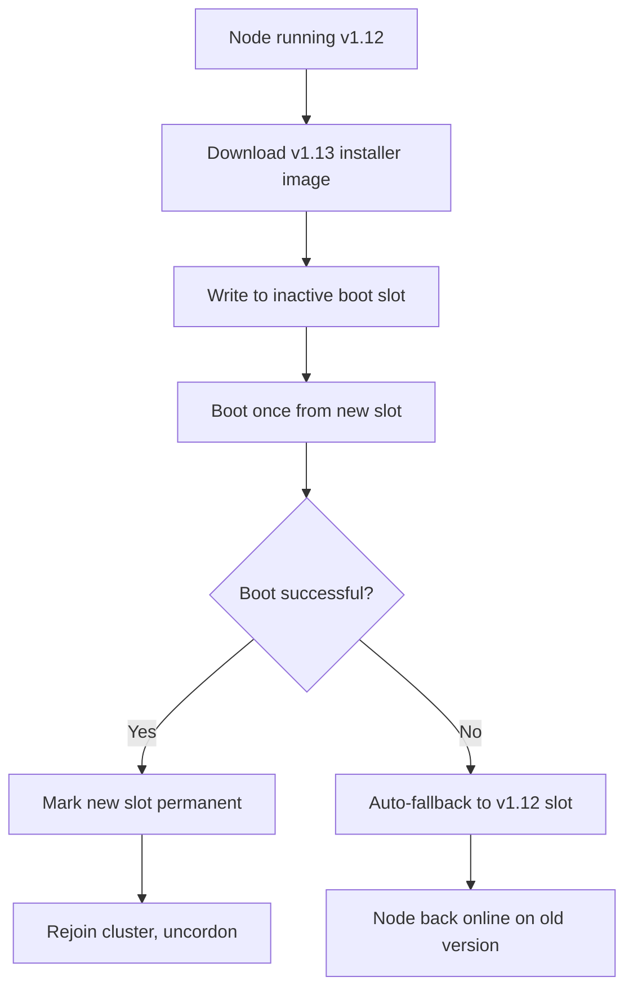
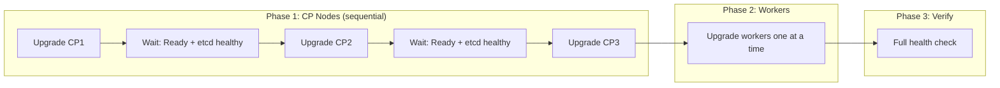
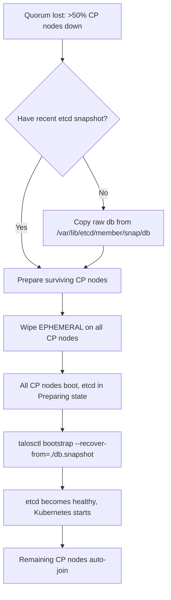

Talos Linux is not your typical Linux distribution. It has no package manager, no SSH, and no mutable root filesystem. This means upgrading it works very differently from running `apt upgrade` or `dnf update` — and it also means that upgrades are safer, more predictable, and reversible by design. But "safe by design" doesn't mean "carefree." A production Kubernetes cluster demands a deliberate, step-by-step approach. This guide covers the full lifecycle: preparing for an upgrade, executing it safely, handling certificate lifecycles, and recovering when things go sideways.

## How Talos Upgrades Actually Work

Talos uses an **A-B image scheme**. Every node has two boot slots — one for the currently running OS image and one for the previous version. When you trigger an upgrade:

1. The new installer image is downloaded and written to the inactive slot.
2. The bootloader is told to "boot once" from the new slot.
3. The node reboots via `kexec` (a fast in-kernel reboot that skips firmware POST).
4. If the new image boots successfully, Talos marks it permanent. If it fails, the bootloader **automatically falls back** to the previous working slot.

This means every upgrade is paired with an implicit rollback option. You don't need to keep old kernels around — Talos does it for you.



## Before You Touch Anything

### 1. Understand the Supported Upgrade Path

Talos only guarantees migration compatibility between **adjacent minor releases**. Jumping from v1.9 to v1.13 directly is untested and risky. The recommended path:

```
v1.9.x → latest v1.9 patch → v1.10.x → latest v1.10 patch → ... → target version
```

Always consult the [Talos release notes](https://github.com/siderolabs/talos/releases) for version-specific caveats. For instance, Talos v1.9 replaced `eudev` with `systemd-udev`, which can change predictable network interface names — something you'd want to know before upgrading.

### 2. Back Up Your etcd Database

This is non-negotiable. A healthy etcd cluster with quorum protects you from single-node failures, but an etcd snapshot protects you from **everything else** — corrupted data, accidental deletes, or multi-node failures during an upgrade.

```bash
# Take a snapshot from any healthy control plane node
talosctl -n <control-plane-ip> etcd snapshot db.snapshot

# Verify it
talosctl -n <control-plane-ip> etcd snapshot db.snapshot
```

Store the snapshot **outside the cluster** — on your laptop, in cloud storage, anywhere that survives a total cluster loss.

> **Pro tip:** Configure scheduled etcd snapshots via `talosctl` cron or your automation pipeline. The snapshot is consistent and identical across all control plane members, so you only need one.

### 3. Back Up Machine Configuration

If a node suffers hardware failure mid-upgrade, you'll need its machine config to rebuild it:

```bash
talosctl -n <node-ip> get mc v1alpha1 -o yaml | yq eval '.spec' - > node-config-backup.yaml
```

### 4. Run a Full Health Check

Before touching anything, confirm the cluster is healthy:

```bash
# Cluster-wide health
talosctl -n <cp1>,<cp2>,<cp3> health

# Check etcd specifically
talosctl -n <cp1>,<cp2>,<cp3> etcd status

# Verify all nodes are Ready
kubectl get nodes
```

If `etcd status` shows a `NOSPACE` alarm, **defragment before upgrading**:

```bash
talosctl -n <cp-ip> etcd defrag
```

## The Upgrade, Step by Step

### The Golden Rule: One Node at a Time

Never upgrade multiple nodes simultaneously. Even though Talos protects etcd quorum on control plane nodes, other cluster components (storage systems like Rook/Ceph, stateful operators) may not handle concurrent reboots gracefully.

### Step 1: Upgrade Control Plane Nodes

Control plane nodes run etcd and the Kubernetes API server. Treat them with extra care:

```bash
# Check current version
talosctl -n <cp-ip> version

# Upgrade one control plane node
talosctl -n <cp-ip> upgrade \
  --image ghcr.io/siderolabs/installer:v1.13.4 \
  --preserve \
  --wait
```

While the upgrade runs, watch the progress:

```bash
# Follow kernel logs during the upgrade
talosctl -n <cp-ip> dmesg -f

# Or use debug mode
talosctl -n <cp-ip> upgrade \
  --image ghcr.io/siderolabs/installer:v1.13.4 \
  --wait --debug
```

**Wait for the node to fully rejoin** before moving to the next:

```bash
kubectl wait --for=condition=Ready node/<node-name> --timeout=300s
talosctl -n <cp1>,<cp2>,<cp3> etcd status
```



### Step 2: Upgrade Worker Nodes

Worker nodes don't run etcd, so the stakes are lower. Still upgrade one at a time:

```bash
talosctl -n <worker-ip> upgrade \
  --image ghcr.io/siderolabs/installer:v1.13.4 \
  --wait

kubectl wait --for=condition=Ready node/<worker-name> --timeout=300s
```

Talos automatically cordons and drains the node before upgrading. For workloads sensitive to ungraceful shutdown, configure a `lifecycle.preStop` hook in your pod specs.

### Step 3: Post-Upgrade Verification

```bash
# Verify all nodes report the new version
talosctl -n <cp1>,<cp2>,<cp3>,<w1>,<w2> version | grep "Tag"

# Cluster health
talosctl health
talosctl -n <cp1>,<cp2>,<cp3> etcd status
kubectl get nodes -o wide
```

### What Happens During the Upgrade Sequence

Under the hood, when you issue `talosctl upgrade`, the node:

1. **Cordons** itself in Kubernetes — no new pods scheduled.
2. **Drains** existing workloads (respecting PodDisruptionBudgets).
3. **Shuts down internal services** — including etcd on control plane nodes.
4. **Leaves etcd membership** (unless `--preserve` is used), after verifying the remaining cluster stays healthy.
5. **Unmounts filesystems** for a clean disk state.
6. **Verifies the disk** and writes the new image.
7. **Sets the bootloader** to try the new slot once.
8. **Reboots via kexec**.
9. On boot: verifies itself, makes the new slot permanent, rejoins the cluster.
10. **Uncordons** itself to accept workloads again.

## Handling the `--stage` Flag

Sometimes an upgrade fails because a process holds a file open, preventing filesystem unmount. The `--stage` flag solves this:

```bash
talosctl -n <node-ip> upgrade --stage \
  --image ghcr.io/siderolabs/installer:v1.13.4
```

This writes the upgrade artifacts to disk and sets a flag checked very early in boot. The node reboots, applies the upgrade in the fresh-boot environment, then reboots once more. The double reboot is fast because Talos uses `kexec`.

## Certificate Lifecycle Management

### How Talos PKI Works

Talos manages its own internal PKI through a component called **trustd**. This handles:

- **Node certificates** — for gRPC communication between Talos components
- **etcd peer/client certificates** — for etcd cluster communication
- **Kubernetes certificates** — API server, kubelet, controller-manager, scheduler

Certificates are automatically rotated before expiry. You can inspect their status at any time:

```bash
# List all certificates and their expiry
talosctl -n <node-ip> get certificates

# Check specific certificate details
talosctl -n <node-ip> get certificates -o yaml
```

### Manual Certificate Renewal

If you need to rotate certificates immediately (e.g., after a security incident):

```bash
# Renew all certificates on a node
talosctl -n <node-ip> rotate-certificates

# Verify the new certs are in use
talosctl -n <node-ip> get certificates
```

Certificate rotation is a **background operation** — it doesn't disrupt running workloads.

### Expired Certificates: Recovery

If certificates expire before automatic rotation kicks in (rare, but possible on nodes that have been offline for extended periods), you'll see gRPC connection errors. Symptoms include TLS errors from `talosctl`, nodes showing `NotReady`, and etcd communication failures.

Recovery requires bootstrapping trust again:

```bash
# On the affected node, apply machine configuration
talosctl -n <node-ip> apply-config -f config.yaml --mode=reboot

# If API access is impossible due to cert issues, use maintenance mode:
talosctl -n <node-ip> reset --graceful=false --reboot
# Then re-apply the machine config from maintenance mode
```

### Preventing Certificate Expiry During Upgrades

Long upgrade chains (e.g., v1.9 → v1.13 through 4 intermediate versions) can span hours or days. Check certificate expiry **before** starting:

```bash
for node in <cp1> <cp2> <cp3> <w1> <w2>; do
  echo "=== $node ==="
  talosctl -n $node get certificates
done
```

If any certificates expire within your planned upgrade window, rotate them **first**, then proceed with OS upgrades.

## When Upgrades Go Wrong: Recovery Playbook

### Scenario 1: Upgrade Fails to Download

```bash
# Symptom: "failed to pull image"
# Cause: Wrong installer image tag, network issue, registry auth
# Fix: Node aborts automatically. Verify the correct tag and retry:
talosctl -n <node-ip> upgrade \
  --image ghcr.io/siderolabs/installer:v1.13.4 --wait
```

### Scenario 2: New Image Fails to Boot

The A-B scheme handles this automatically: the bootloader falls back to the previous working slot, and the node returns on the old version. Check logs:

```bash
talosctl -n <node-ip> dmesg | tail -100
```

### Scenario 3: Manual Rollback

If the upgrade "succeeds" but your workloads break on the new version:

```bash
# Roll back to the previous Talos version
talosctl -n <node-ip> rollback
```

### Scenario 4: Control Plane Node Won't Rejoin etcd

```bash
# Step 1: Check etcd health from a working CP node
talosctl -n <working-cp> etcd members
talosctl -n <working-cp> service etcd

# Step 2: Check the problem node
talosctl -n <problem-node> version
talosctl -n <problem-node> service etcd

# Step 3: Reset its EPHEMERAL partition to rejoin fresh
talosctl -n <problem-node> reset \
  --graceful=false --reboot \
  --system-labels-to-wipe=EPHEMERAL
```

**Warning:** Only wipe one CP node at a time. Wiping two out of three means permanent quorum loss.

### Scenario 5: Complete Quorum Loss (Disaster Recovery)

If you lose more than half your control plane nodes during an upgrade:



The commands:

```bash
# 1. On each control plane node, wipe etcd data
for node in <cp1> <cp2> <cp3>; do
  talosctl -n $node reset --graceful=false --reboot \
    --system-labels-to-wipe=EPHEMERAL
done

# 2. Bootstrap from snapshot on any ONE CP node
talosctl -n <cp1> bootstrap --recover-from=./db.snapshot

# If snapshot was copied raw (not via talosctl etcd snapshot):
talosctl -n <cp1> bootstrap --recover-from=./db.snapshot \
  --recover-skip-hash-check
```

## The Kubernetes Version: A Separate Concern

Since Talos v1.0, OS upgrades **do not** upgrade Kubernetes. Manage them independently:

```bash
talosctl -n <cp-ip> upgrade-k8s --to v1.31.0
```

Same rules apply: upgrade control plane nodes first (sequentially), then workers. Check the [Kubernetes version skew policy](https://kubernetes.io/releases/version-skew-policy/).

**Recommended order:**
1. Upgrade Talos OS on all nodes (control plane, then workers)
2. Upgrade Kubernetes on control plane nodes
3. Upgrade Kubernetes on worker nodes
4. Verify with `talosctl health` and `kubectl get nodes`

## Integrating Upgrades with GitOps (FluxCD)

If your cluster is managed via FluxCD, upgrades still happen through `talosctl` — not through Git. GitOps-aware practices:

1. **Before upgrading**, commit and push any pending Flux changes.
2. **Suspend Flux reconciliation** during the upgrade window:

   ```bash
   flux suspend kustomization --all
   ```

3. **After all nodes are healthy**, resume:

   ```bash
   flux resume kustomization --all
   ```

4. **Update machine configuration** in your Git repo to reflect new Talos features.

## Quick Reference Card

| Action | Command |
|---|---|
| **Backup etcd** | `talosctl -n <cp> etcd snapshot backup.db` |
| **Backup machine config** | `talosctl -n <node> get mc v1alpha1 -o yaml \| yq eval '.spec' -` |
| **Cluster health check** | `talosctl -n <cp1>,<cp2>,<cp3> health` |
| **etcd status** | `talosctl -n <cp1>,<cp2>,<cp3> etcd status` |
| **Upgrade a node** | `talosctl -n <node> upgrade --image ghcr.io/siderolabs/installer:v<ver> --wait` |
| **Upgrade with staging** | `talosctl -n <node> upgrade --stage --image ghcr.io/siderolabs/installer:v<ver>` |
| **Manual rollback** | `talosctl -n <node> rollback` |
| **Check certificates** | `talosctl -n <node> get certificates` |
| **Rotate certificates** | `talosctl -n <node> rotate-certificates` |
| **Reset node (wipe etcd)** | `talosctl -n <node> reset --system-labels-to-wipe=EPHEMERAL --reboot` |
| **Disaster recovery bootstrap** | `talosctl -n <cp> bootstrap --recover-from=./backup.db` |
| **Upgrade Kubernetes** | `talosctl -n <cp> upgrade-k8s --to v1.31.0` |
| **Edit machine config** | `talosctl -n <node> edit mc --mode=staged` |
| **Suspend Flux (during upgrade)** | `flux suspend kustomization --all` |

## Final Checklist

Before you start any upgrade:

- [ ] Read the release notes for the target Talos version
- [ ] Verify the upgrade path is supported (adjacent minor releases)
- [ ] Take an etcd snapshot and store it off-cluster
- [ ] Back up machine configurations for all nodes
- [ ] Run `talosctl health` and `kubectl get nodes` — all green
- [ ] Check certificate expiry dates
- [ ] Ensure you have console/out-of-band access in case of network issues
- [ ] Choose a low-traffic period

For each node you upgrade:

- [ ] Confirm the node is `Ready` before starting
- [ ] Upgrade with `--wait` (or `--stage` if needed)
- [ ] Wait for the node to return to `Ready`
- [ ] Verify etcd health before upgrading the next control plane node
- [ ] Check pod rescheduling on the upgraded node

---

## Sources

- [Talos Linux: Upgrading Talos](https://www.talos.dev/v1.9/talos-guides/upgrading-talos/) — Official upgrade guide
- [Talos Linux: Disaster Recovery](https://www.talos.dev/v1.9/advanced/disaster-recovery/) — etcd backup and recovery procedures
- [Talos Linux: Editing Machine Configuration](https://www.talos.dev/v1.9/talos-guides/configuration/editing-machine-configuration/) — Config patching modes
- [Talos Linux: etcd Maintenance](https://www.talos.dev/v1.9/advanced/etcd-maintenance/) — etcd defrag and space management
- [Talos Linux Releases](https://github.com/siderolabs/talos/releases) — Release notes and upgrade caveats
- [Kubernetes Version Skew Policy](https://kubernetes.io/releases/version-skew-policy/)
- [FluxCD Documentation](https://fluxcd.io/flux/)
