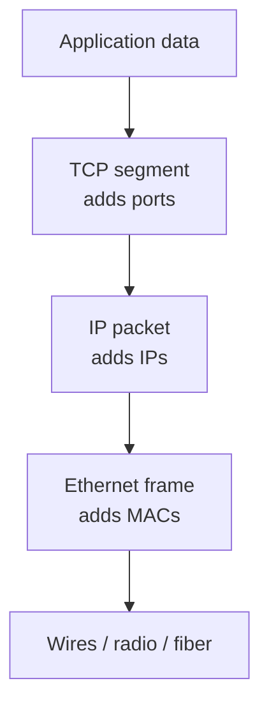
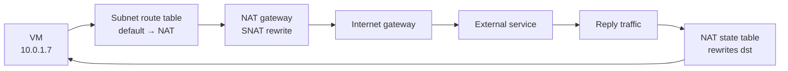
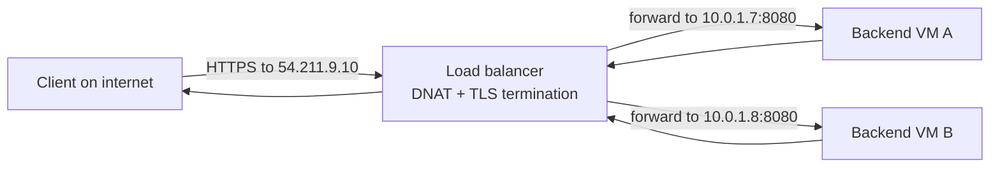
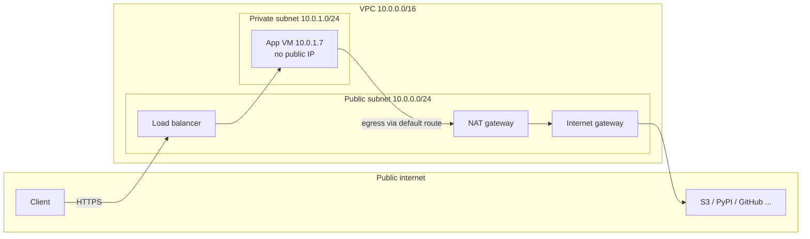

# How networking actually works

If you work with cloud infrastructure, you touch networking every day — usually at the level of abstraction providers hand you: a VPC here, a subnet there, a "public gateway" checkbox for egress, a load balancer resource for ingress. This article peels that abstraction back. By the end, you should be able to explain to a colleague what actually happens, packet by packet, when a VM in a private subnet reaches the internet, and when traffic from the internet reaches that VM.

The goal is practical understanding for the work we do as platform engineers: configuring networks, debugging when traffic mysteriously stops, and reasoning about security boundaries.

## The core mental model: layers

Networking is famously layered, and the layering exists for one reason: each layer only needs to solve one problem and only talks to the layer directly below it.

The theoretical model is the **OSI model** (7 layers). The model the internet actually runs on is **TCP/IP** (4 layers). They map to each other loosely; memorizing either matters less than understanding the split of responsibilities.

| TCP/IP layer | OSI layers | What it does | Key protocol examples |
| ------------ | ---------- | ------------ | --------------------- |
| Link | 2 | Move a frame between two machines on the same physical network segment | Ethernet, ARP |
| Internet | 3 | Route a packet across *different* networks toward a destination IP | IP (v4/v6), ICMP |
| Transport | 4 | Move data between two processes; reliability, ports, ordering | TCP, UDP |
| Application | 5–7 | The actual protocol your workload speaks | HTTP, DNS, SSH, gRPC |

When a packet moves through the network:

1. The app hands an HTTP request to TCP.
2. TCP breaks it into segments, adds a header with source and destination ports.
3. IP wraps each segment with a header containing source and destination IP addresses.
4. Ethernet wraps that in a frame with source and destination MAC addresses (only meaningful within the local network segment).
5. The receiving machine reverses the process.



Port numbers exist so multiple applications on one machine can share an IP address. A destination IP gets the packet to the *machine*; the destination port gets it to the *process* on that machine. The combination `(source IP, source port, destination IP, destination port, protocol)` uniquely identifies a connection — this "5-tuple" shows up everywhere once you start reading firewall rules and flow logs.

## IP addresses, subnets, and why prefixes matter

An IPv4 address is a 32-bit number, conventionally written as four octets like `10.0.1.7`. Networks are carved out of that space using **CIDR notation**: `10.0.0.0/16` means "the first 16 bits are fixed; the remaining 16 are free for hosts." That yields addresses `10.0.0.0` through `10.0.255.255` — 65,536 addresses.

A **subnet** is just a slice of a bigger network, defined by giving it a longer (more specific) prefix. An AWS VPC assigned `10.0.0.0/16` might be carved into:

```
10.0.0.0/20   -> subnet A  (4,096 addresses)
10.0.16.0/20  -> subnet B
10.0.32.0/20  -> subnet C
...
```

A **supernet** (or "route aggregation") is the opposite: combining several adjacent small networks into a shorter prefix. If you have subnets `10.0.0.0/24`, `10.0.1.0/24`, `10.0.2.0/24`, and `10.0.3.0/24`, they can be summarized as `10.0.0.0/22`. Routers do this to keep their forwarding tables small; a cloud provider might advertise a handful of supernets to the public internet instead of every individual customer prefix.

Prefixes matter practically in two places:

1. **Route tables use longest-prefix match.** If a router has routes for both `10.0.0.0/16` and `10.0.1.0/24`, a packet to `10.0.1.5` follows the more specific `/24`. This is how providers can add targeted override routes without renumbering anything.
2. **Private vs public space.** RFC 1918 reserves three ranges for private use: `10.0.0.0/8`, `172.16.0.0/12`, and `192.168.0.0/16`. These are forbidden from public routing tables — any router on the internet drops them. Cloud VPCs default to these ranges, which is why you need NAT for egress and why overlapping CIDRs between your VPC and your on-prem network cause painful VPN headaches.

## How routers actually forward packets

Every IP router holds a **forwarding table**: a list of destination prefixes, each mapped to a "next hop" IP. The algorithm is remarkably simple:

```
for each packet:
    find the longest prefix that matches destination IP
    if no match: drop (or follow a default route)
    otherwise: pass packet to matched next hop
```

The entry `0.0.0.0/0` — the **default route** — matches everything, so it's the catch-all that sends traffic "toward the internet."

Routers don't memorize the entire internet. Inside your VPC, a tiny table suffices (a route per subnet plus a default). Router tables grow massive only at the *backbone*, where providers exchange prefix information with **BGP** (Border Gateway Protocol). BGP is the closest thing the internet has to a global addressing scheme: networks called Autonomous Systems (ASes) advertise which prefixes they can deliver traffic for, and the path a packet takes from Hamburg to Tokyo is whichever sequence of AS advertisements happened to look shortest or cheapest to each router along the way.

One detail that surprises people: within a single layer-2 segment (e.g., your laptop to your home router), IP isn't used at all for hop-by-hop forwarding. The machine first uses **ARP** to learn "who has IP 192.168.1.1? Tell 192.168.1.7" and the answer comes back as a MAC address. The Ethernet frame is then addressed to that MAC. Every router hop repeats this dance on the next segment.

## DNS: the phonebook that makes it usable

IP addresses are how machines find each other; humans need names. **DNS** is a distributed lookup system that translates `wachs.software` into `203.0.113.7`. It's a tiered system:

- Your OS checks its local cache and `/etc/hosts`.
- If empty, it asks a resolver (typically your ISP's or a public one like `1.1.1.1`).
- The resolver asks root servers → `.software` TLDs → the domain's authoritative name server, which finally returns the record.

As a platform engineer you care because DNS is often the "load balancer before the load balancer": a cloud load balancer is typically exposed as a DNS record, and health-checked failover (Route53, etc.) is just changing what IP the name resolves to based on health. This is also why DNS TTLs matter operationally — a 5-minute TTL means failover takes at most 5 minutes for fresh clients, but cached records may hold stale IPs longer.

## Egress: how a private VM reaches the internet

Now we get to the part you actually configure in the cloud.

A VM in a private subnet has only a private IP, e.g. `10.0.1.7`. Public routers won't route that. To reach, say, `pypi.org`, three things must exist:

1. **A NAT gateway** (or equivalent: AWS NAT Gateway / Internet Gateway, GCP Cloud NAT, Azure NAT Gateway) — a device that sits between your VPC and the internet.
2. **A route** in the subnet's route table: `0.0.0.0/0 → nat-gateway-id`.
3. **A security group / firewall rule** permitting the outbound traffic.

When your VM sends a packet to `pypi.org`:

```
VM at 10.0.1.7:44321 wants to reach pypi.org (resolved to 151.101.0.223:443)

  → VM sends packet: src=10.0.1.7:44321 dst=151.101.0.223:443
  → Subnet route table sees dst is outside VPC, matches default route
  → Packet arrives at NAT gateway
  → NAT gateway rewrites src to its own public IP: src=54.211.3.9:44321 dst=151.101.0.223:443
     (records this mapping in a state table)
  → pypi's server sees a connection from 54.211.3.9 and replies to it
  → Return packet hits NAT gateway, gateway consults state table,
     rewrites dst back to 10.0.1.7:44321, forwards to your VM
```

This is **SNAT** — Source Network Address Translation. The VM stays invisible to the outside world; the world only ever sees the gateway's public IP. This is one reason why "VPC + NAT Gateway + private subnet" is the standard pattern for anything that shouldn't be directly reachable: database servers, internal microservices, batch workers.

Contrast with a VM that *should* be public: it gets a public IP assigned directly (AWS Elastic IP, etc.) and its subnet route table points `0.0.0.0/0` straight at the Internet Gateway rather than a NAT device.



## Ingress: how traffic from the internet reaches your VM

Ingress is the mirror image of egress, and this is where **load balancers** earn their keep. You don't want a random internet client to reach your VM's private IP — they can't, the route doesn't exist. So you deploy a load balancer with a public IP (or hostname), and it does **DNAT** (Destination NAT) for you.

A typical AWS ALB, for example:

1. Receives an HTTP request on its public address `54.211.9.10`.
2. Looks at the path/headers and a target group it was configured with.
3. Forwards the request to a healthy backend: `dst=10.0.1.7:8080` (rewriting destination IP/port in the process).
4. The backend replies to the load balancer; the load balancer relays the response to the client.

For the client, the load balancer *is* the service. The fact that the real work happens on `10.0.1.7` is an implementation detail. Load balancers also typically:

- **Terminate TLS** so your app speaks plain HTTP internally.
- **Health-check** backends and stop sending traffic to sick ones.
- **Spread load** across many backends — often across availability zones.
- Add headers like `X-Forwarded-For` so your app knows the original client IP.



There are many load balancer flavors, broadly split by the layer they work at:

| Type | Works at | Example |
| ---- | -------- | ------- |
| L7 / HTTP-aware | Application layer (sees paths, headers, cookies) | AWS ALB, Nginx, Traefik |
| L4 / TCP-aware | Transport layer (sees only IPs and ports) | AWS NLB, classic HAProxy |
| DNS-based | "Layer 0": picks one IP among several + health checks | Route53 latency-based, Cloudflare |

Pick L7 when you want routing on URL paths or hostnames (an ingress controller), L4 when you want raw throughput and pass-through TLS, and DNS when you're doing geo-routing or active-active across regions.

## Security groups and network ACLs: the gating layer

Routing determines where a packet *can* go. Security groups and ACLs decide whether it's *allowed*. They're firewalls with different scopes:

- **Security groups** attach to individual resources (VMs, load balancers, RDS databases). They're *stateful*: if you allow outbound traffic, return traffic is automatically permitted. This is why you can give a VM egress to the internet with no inbound rules and have functional web browsing.
- **Network ACLs** attach to subnets. They're *stateless*: inbound and outbound rules are evaluated independently, and you must explicitly allow both directions. They're useful for blocking known-bad CIDRs at the subnet boundary, but clumsy for per-service security.

The two compose. Traffic from the internet to your backend VM typically passes:

```
Internet → NACL (subnet, stateless)
        → Load balancer security group (stateful)
        → NACL again
        → Backend VM security group
```

A single "no" anywhere kills the packet — and none of these layers return an error, they just drop silently. This is the classic source of "the traffic just disappears" debugging sessions. When debugging, walk the chain from source to destination, layer by layer, and check the most specific rule first.

A habit worth building: for any given traffic flow you're trying to allow, write down the tuple `(source, destination, port, protocol)` and then walk every gating layer asking "does this rule let that tuple through?" Vague intuitions break down quickly; the tuple never lies.

## Public gateways vs the internet vs your VPC

A concrete AWS-flavored picture of the entire path, end to end:



Reading it:

- The **Internet gateway** is just a router interface attached to the VPC that knows how to forward packets between the VPC and the provider's wide-area network.
- The **NAT gateway** sits in a public subnet and shares the Internet gateway; but it only handles *outbound* connections from private hosts.
- The **load balancer** also sits in the public subnet (in the inbound direction it's where the public IP actually lives); inbound traffic flows from client → LB → VM.
- The **VM** lives in a private subnet. Its route table says "anything not inside the VPC goes via the NAT gateway." Its security group allows inbound only from the load balancer.

This is the plumbing pattern you see everywhere. Azure and GCP have different names, but the anatomy is nearly identical.

## Practical takeaways

1. **Subnets are slices of address space rendered as routing rules.** Shorter prefix (like `/16`) = bigger net; `/24` and `/20` are the sweet spots for actual subnets.
2. **Longest-prefix match is the only routing rule that matters** day to day. Everything else is BGP plumbing that mostly works.
3. **Private IPs are unreachable by design**, not by accident. The VM behind a NAT gateway never has a bad day because someone port-scanned it.
4. **NAT is the egress story; a load balancer is the ingress story.** SNAT rewrites source addresses on the way out; DNAT rewrites destination addresses on the way in.
5. **Security groups are stateful per-resource; NACLs are stateless per-subnet.** Use security groups for application logic, NACLs for coarse subnet-level blocking.
6. **When debugging, walk the whole chain**: VPC routes → NACL → LB SG → backend SG → app. One silent drop anywhere kills the packet without telling you which layer was responsible.
7. **The OSI model is a vocabulary**, not an implementation. Use it to talk precisely about whether the problem is at L3 (routing), L4 (ports/TCP), or L7 (HTTP, TLS, headers). That's often the fastest way to get unstuck.

These seven facts, fully internalized, are genuinely enough to reason about almost every cloud networking task I've encountered: configuring VPCs, troubleshooting failed health checks, figuring out why two services can't reach each other across a peering connection, or deciding whether something belongs in front of or behind the load balancer.

## Sources

- Kurose & Ross, *Computer Networking: A Top-Down Approach* — the standard textbook treatment of layering, routing, and the OSI model.
- [RFC 791 — Internet Protocol (1981)](https://datatracker.ietf.org/doc/html/rfc791)
- [RFC 1918 — Address Allocation for Private Internets](https://datatracker.ietf.org/doc/html/rfc1918)
- [RFC 3022 — Traditional NAT](https://datatracker.ietf.org/doc/html/rfc3022)
- [AWS: How NAT gateways work](https://docs.aws.amazon.com/vpc/latest/userguide/nat-gateway-working-with.html)
- [AWS: Elastic Load Balancing](https://docs.aws.amazon.com/elasticloadbalancing/latest/userguide/what-is-load-balancing.html)
- [GCP: Cloud NAT overview](https://cloud.google.com/nat/docs/overview)
- [Cloudflare Learning Center: What is BGP?](https://www.cloudflare.com/learning/security/glossary/what-is-bgp/)
